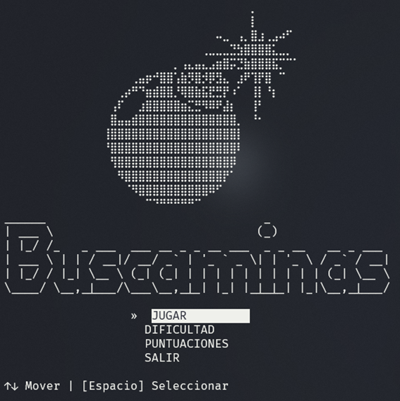
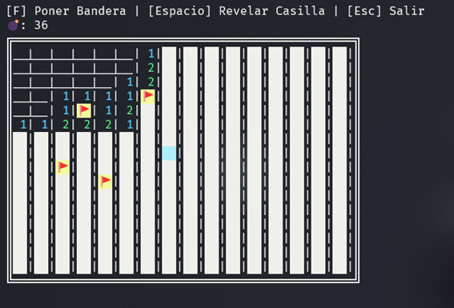

# Buscaminas en Terminal | Minesweeper on Terminal | Cpp
Juego buscaminas clásico, simulado en una interfaz de terminal. Se hizo uso de la librería rlutil para gestionar la parte "gráfica". Tiene un registro de puntajes y variación de dificultad dinámica. 
## 📸 Vistas del Juego

| Menú Principal | Partida en Curso (Dificultad Intermedia) |
| :---: | :---: |
|  | |
## 🕹️🎮 Controles
| Tecla | Acción |
| :--- | :--- |
| `Flechas` | Mover el cursor |
| `Espacio` | Seleccionar/ Revelar Casilla
| `F` /`f`| Poner/Quitar Bandera
| `ESC` | Salir de la partida

## Instalación
### Compilación manual (Con MinGW)
Ingresa a la ruta en la que tienes descargado el juego y ejecuta el siguiente comando desde terminal. 

``` bash 
g++ -o buscaminasTerminalv2.0.exe main.cpp funciones/*.cpp  
```

### Ejecutable
Se puede descargar el ejecutable directamente. Ten en cuenta que el juego depende de la carpeta `/src` para el guardado de puntajes y la carga de menús visuales. 

> **Nota:** Si descargas el ejectutable y Windows lo marca como virus, es un "falso positivo" común en programas de C++ no firmados. De cualquier manera, se recomienda compilar el código fuente manualmente. 

## Caracterísitcas
- Generación de minas aleatorias. 
- Sistema de dificultades (Fácil, Intermedio, Experto, Extremo).
- Interfaz de colores en consola mediante `rlutil.h`.


## Conceptos aplicados 
- **Estructuras de datos:** Uso de `enum`, `struct` y `vector`.
- **Paso por referencia:** Optimización de memoria usando `&`.
- **Modularización:** Organización del código en múltiples archivos `.cpp` y `.h`.
- **Gestión de archivos:** Lectura y escritura de archivos `CSV` para puntajes.
- **Recursividad:** Funciones de búsqueda de casillas con recursividad. 
## Tecnologías utilizadas
- **C++**
- **rlutil.h**: Para el manejo de colores y captación de teclas.
- **CSV**

## Créditos
- **Menú Interactivo**: Para la realización del menú interactivo se tomo como referencia y ayuda didáctica el video tutorial del canal [The Regext](https://www.youtube.com/watch?v=l7x72honaD0). 
- **Arte ASCII (Bomba):** Obtenido a través de [EmojiCombos](https://emojicombos.com/bomb).
- **Arte ASCII (Texto):** Generado a través de  [Patorjk](https://patorjk.com/software/taag/#p=display&f=Graffiti&t=Type+Something+&x=none&v=4&h=4&w=80&we=false).


